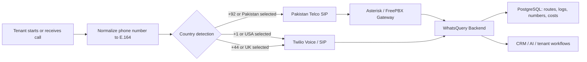
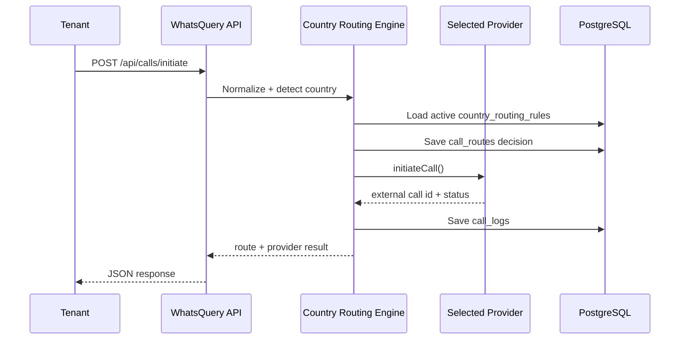
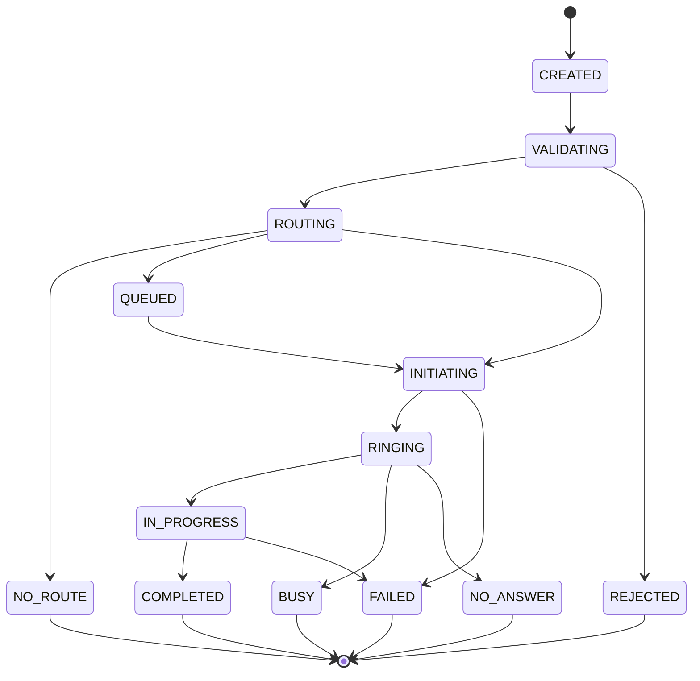
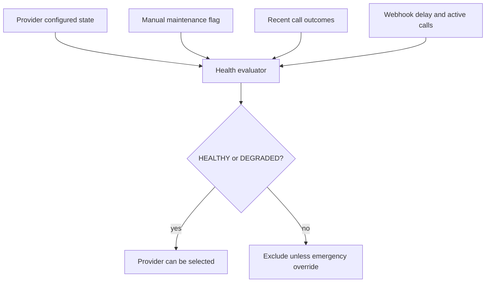
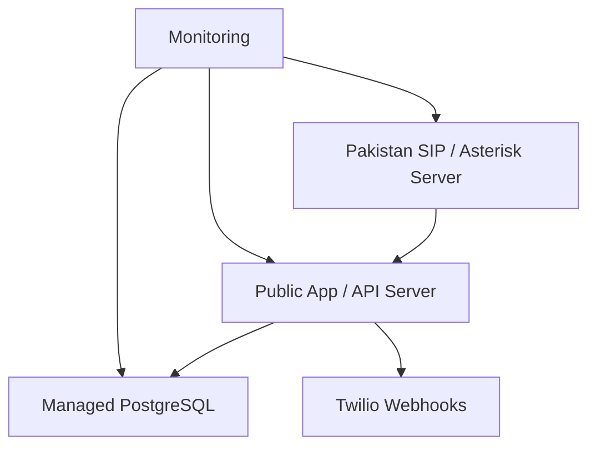

# WhatsQuery International Call Routing Architecture

WhatsQuery remains Pakistan-first while becoming ready for USA and UK calling.

## Routing Rule



## Provider Selection



## Tables

- `providers`: Pakistan local SIP provider, Twilio USA, Twilio UK, and future providers.
- `country_routing_rules`: maps country/dial code to primary and fallback providers.
- `phone_numbers`: tenant-owned numbers, provider mapping, verification, caller ID status.
- `call_routes`: immutable routing decisions for capacity planning and debugging.
- `call_logs`: provider call events, duration, recording URL, transcript id, cost, and currency.
- `calls`: logical tenant call intent, normalized destination, idempotency key, request fingerprint, and current normalized state.
- `call_attempts`: provider-specific attempts for primary/fallback providers.
- `call_events`: immutable provider/internal event timeline with deduplication by provider event id.
- `telecom_webhook_nonces`: replay protection for signed local SIP/Asterisk webhooks.
- `provider_health_checks`: immutable provider-health samples used for operations and capacity planning.

## Call Lifecycle



Every outbound request creates or reuses a logical `calls` row. Provider-specific delivery is stored as one or more `call_attempts`. Provider webhooks are stored as immutable `call_events`; duplicate events return safely without changing state twice.

## Idempotency

Outbound initiation accepts the `Idempotency-Key` header or a validated request-body key. Keys are scoped by tenant:

```text
tenant_id + idempotency_key
```

Repeated requests with the same fingerprint return the original logical call. Reusing the same key with materially different call data is rejected.

## Current Default Routes

| Country | Dial Code | Provider |
| --- | --- | --- |
| Pakistan | `+92` | Pakistan Telco SIP through Asterisk/FreePBX |
| USA | `+1` | Twilio Voice/SIP |
| UK | `+44` | Twilio Voice/SIP |

## Security Requirements

- Provider credentials stay server-side in environment variables or encrypted database fields.
- Twilio webhooks are signature-validated.
- Asterisk webhooks require HMAC headers: `x-wq-timestamp`, `x-wq-nonce`, and `x-wq-signature`.
- SIP access should be IP-restricted at firewall/provider level.
- Outbound calling is rate-limited per tenant.
- Blocked destination prefixes are controlled by `VOICE_BLOCKED_DESTINATIONS`.
- Tenant APIs must only show tenant-owned numbers/logs.
- Admin call logs are platform-admin only.
- Recording consent must be configured by country before enabling live recording.
- Caller ID must be tenant-owned, verified, and enabled for outbound use.
- Unknown webhook tenant mappings are rejected; there is no first-tenant fallback.
- Real calling remains disabled by default through `VOICE_TWILIO_CALLING_ENABLED=false` and `VOICE_ASTERISK_CALLING_ENABLED=false`.

## Provider Health and Routing Readiness

Provider health is evaluated centrally before routing:



Provider-health checks never place real calls. Twilio-style checks validate safe account/configuration readiness. Asterisk-style checks use a heartbeat/status endpoint when configured.

## Deterministic Route Simulation

`POST /api/admin/routing-rules/simulate` reuses the same routing engine as real call initiation. It validates tenant, destination, caller ID, country rule, provider status, health, capacity, and fallback candidates. It returns a safe decision trace and masked numbers, and never calls a provider.

Decision traces use safe codes such as:

- `TENANT_ACTIVE`
- `DESTINATION_VALID`
- `DESTINATION_ALLOWED`
- `CALLER_ID_AUTHORIZED`
- `COUNTRY_RULE_MATCHED`
- `PROVIDER_ENABLED`
- `PROVIDER_HEALTH_ACCEPTABLE`
- `PROVIDER_CAPACITY_AVAILABLE`
- `PRIMARY_PROVIDER_SELECTED`
- `FALLBACK_PROVIDER_ADDED`
- `NO_ROUTE_AVAILABLE`

## Operational Maintenance

- Stuck calls in `QUEUED`, `INITIATING`, `RINGING`, or `IN_PROGRESS` can be reconciled by `reconcileStuckCalls`.
- Reconciliation does not place or retry calls; it creates a `CallEvent` and applies the central state machine.
- Webhook nonces include `expiresAt` and can be cleaned by `cleanupExpiredTelecomWebhookNonces`.
- Existing BullMQ and database-backed `VoiceJob` patterns are available, but telecom webhooks remain synchronous and transaction-safe until a dedicated production worker is deployed.

## Current Production Gaps

- Rate limiting is still process-local and should move to the existing Redis/BullMQ stack before high-volume production.
- Provider health is persisted, but live provider sandbox checks still need staging validation.
- Route simulator is implemented for admin use, but broader simulator audit history is limited to platform audit logs.
- Commercial billing ledger/rate snapshots are prepared conceptually but not implemented in this phase.

## MVP Deployment Notes

The MVP can run on the current Contabo VPS for low traffic if:

- `VOICE_TWILIO_CALLING_ENABLED=false` until Twilio credentials and webhooks are tested.
- `VOICE_ASTERISK_CALLING_ENABLED=false` until Asterisk originate/webhook endpoints are verified.
- Asterisk/FreePBX is reachable only from approved IPs.
- Database migrations are applied with `npx prisma migrate deploy`.

## Production Split

For production scale:



- Separate app/API server.
- Separate PostgreSQL server.
- Separate SIP/Asterisk server.
- Keep Pakistan SIP workloads on Pakistan-hosted or telco-approved infrastructure.
- Monitor SIP availability, failed calls, webhook errors, CPU, RAM, disk, and DB health.

## Future Countries

To add a new country:

1. Add a `providers` row.
2. Add a `country_routing_rules` row.
3. Add provider adapter if the provider type is new.
4. Add country consent/calling policy.
5. Validate webhook mapping and cost reporting before enabling live calls.
