# WhatsQuery Technical Overview for Telecom Partners

## Document Purpose

This document explains how WhatsQuery works from a telecom, cloud infrastructure, SIP trunking, data flow, and enterprise integration perspective. It is designed to help telecom operators, data center teams, SIP engineers, and enterprise technology stakeholders understand the platform architecture and deployment model.

WhatsQuery positioning:

> Bridging the gap between Carrier Networks and Enterprise Databases.

WhatsQuery connects business communication channels such as phone calls, SIP trunks, WhatsApp/business messaging, AI workflows, customer data, CRM/ERP records, call logs, and operational dashboards into one secure business automation platform.

## 1. High-Level Product Overview

WhatsQuery is a multi-tenant SaaS platform for small and growing businesses. It currently includes two major product areas:

- WhatsQuery ERP: business operations platform for customers, products, inventory, sales, purchases, finance, reports, users, roles, subscriptions, and Smart Assistant workflows.
- WhatsQuery Voice: AI receptionist and business communication automation platform for calls, WhatsApp messages, leads, appointments, order requests, call logs, usage tracking, and tenant-level business training.

For telecom partnership purposes, the most relevant product is WhatsQuery Voice.

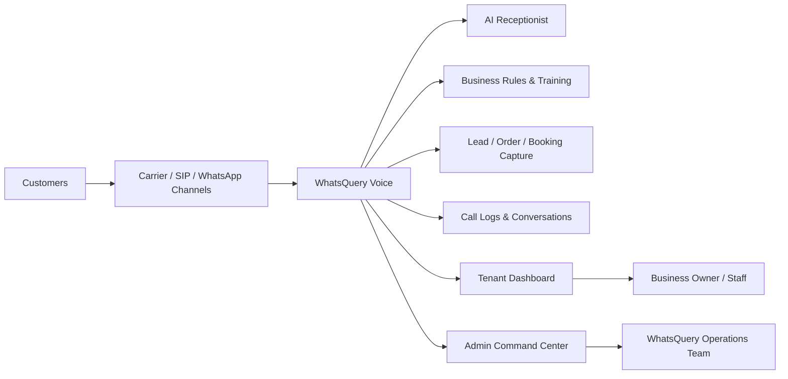

## 2. Core Platform Components

WhatsQuery consists of the following major layers:

| Layer | Purpose |
|---|---|
| Web Dashboard | Tenant and admin user interface |
| Backend API | Business logic, tenant enforcement, billing, integrations |
| PostgreSQL Database | Tenant data, call logs, leads, business profiles, usage records |
| SIP / Asterisk Layer | SIP trunking, inbound call routing, call metadata, optional recordings |
| WhatsApp Channel | WhatsApp Business Platform integration and customer conversations |
| AI Workflow Layer | AI receptionist prompts, intent handling, safe action routing |
| Admin Command Center | Platform monitoring, tenant management, usage, costs, support |
| Monitoring & Logs | System health, errors, slow queries, backup status |
| Backup Layer | Database, media, configuration, and disaster recovery backups |

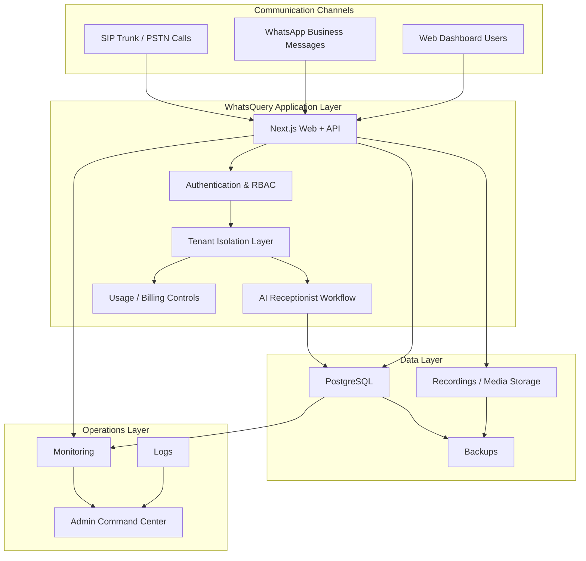

## 3. Multi-Tenant Model

Each business using WhatsQuery is represented as a tenant or organization. Tenant data is separated by `organizationId`.

Examples:

- Cafe tenant with 2 branches
- Restaurant tenant with 4 branches
- Clinic tenant with appointment workflows
- Retail tenant with support/order workflows

Tenant-specific data includes:

- Business profile
- Branches
- Users and roles
- Voice agents
- Receptionist settings
- Knowledge base and FAQs
- Leads
- Orders and booking requests
- Call logs
- WhatsApp conversations
- Usage and billing records

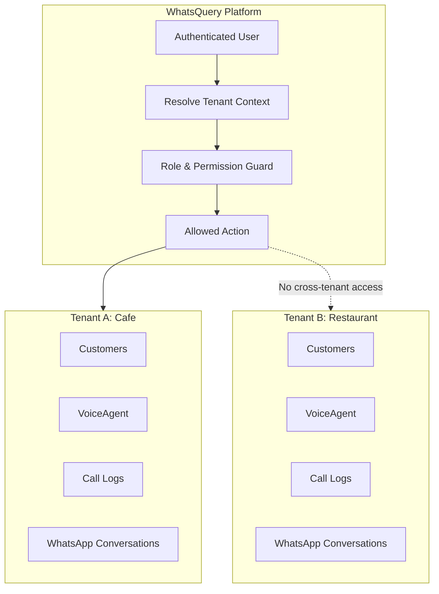

## 4. WhatsQuery Voice: AI Receptionist Concept

WhatsQuery Voice is a business communication layer that helps businesses handle customer interactions over phone and WhatsApp.

It can:

- Answer common business questions
- Explain business hours
- Capture customer details
- Capture leads
- Capture appointment requests
- Capture table booking requests
- Capture order/takeaway requests
- Escalate to staff when needed
- Store call/message logs
- Generate usage and cost reports

It must not:

- Invent prices
- Invent discounts
- Confirm availability without backend confirmation
- Give medical/legal/financial advice
- Confirm bookings or orders unless the business rules allow it
- Use data from another tenant

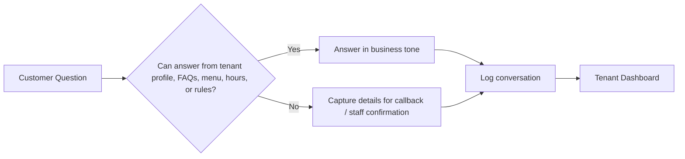

## 5. Phone Call / SIP Trunk Flow

For telecom integration, inbound calls can be routed from the carrier/SIP trunk into the WhatsQuery SIP/Asterisk layer. The call is then connected to the WhatsQuery Voice workflow.

Recommended production approach:

- Telecom operator provides SIP trunk and DID numbers.
- SIP trunk is IP-whitelisted to a Pakistan-hosted WhatsQuery SIP/Asterisk server.
- Asterisk handles call routing and call metadata.
- WhatsQuery maps the DID/phone number to the correct tenant and VoiceAgent.
- AI receptionist handles the conversation.
- Call metadata, duration, recording link if enabled, and summary are stored under the tenant.

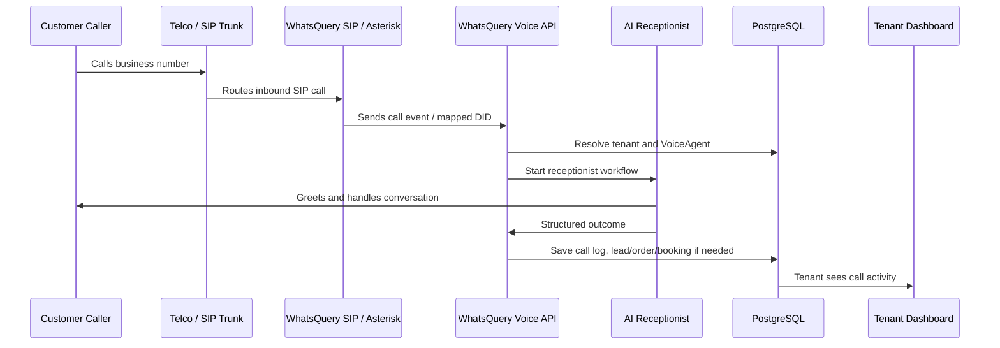

## 6. WhatsApp AI Receptionist Flow

WhatsQuery also supports WhatsApp Business Platform as a separate channel. This is important for Pakistani businesses because many businesses rely heavily on WhatsApp for sales, support, orders, and customer communication.

WhatsApp channel behavior:

- Customer sends WhatsApp message to business number.
- Meta webhook sends event to WhatsQuery.
- WhatsQuery maps by WhatsApp `phoneNumberId`.
- The mapped tenant and VoiceAgent are loaded.
- AI response is generated using only that tenant's business training profile.
- Reply is sent through WhatsApp Cloud API if enabled.
- If live sending is disabled, the reply is stored as a draft/not-sent record.
- Conversations are visible in tenant dashboard.
- Admin can monitor mappings and failed/unsent messages.

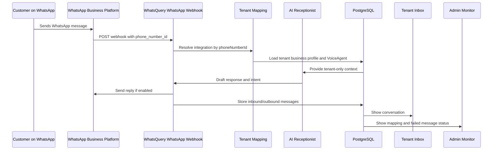

## 7. Tenant Business Training Profile

The AI receptionist is trained from tenant-controlled business information.

Training data includes:

- Business name
- Industry
- Branch/location details
- Opening hours
- Greeting message
- FAQs
- Services/menu
- Pricing notes
- Booking rules
- Order rules
- Handoff rules
- Allowed and blocked actions
- Language and tone

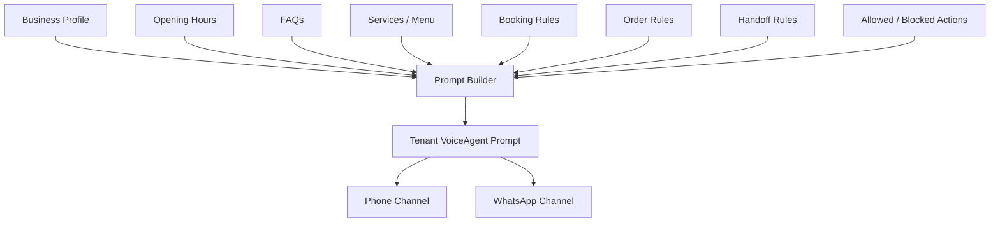

## 8. Data Flow and Storage

WhatsQuery stores operational records under each tenant.

Key stored data:

- Users and roles
- Tenant business profile
- VoiceAgent configuration
- Call logs
- WhatsApp conversations and messages
- Leads
- Order requests
- Appointment/reservation requests
- Usage records
- Cost records
- Audit logs
- Integration settings

Sensitive tokens are encrypted or stored as hashes where appropriate.

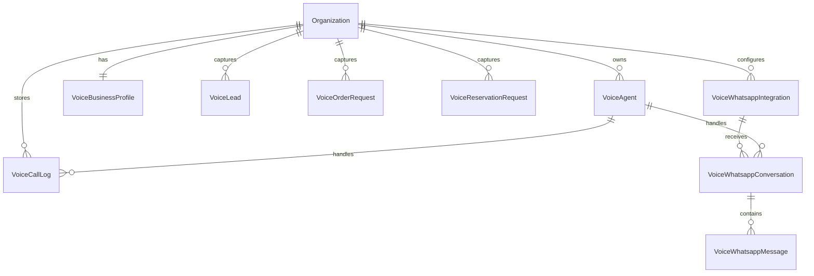

## 9. Admin and Tenant Views

Tenant dashboard:

- Business profile
- AI receptionist settings
- Knowledge base
- Leads
- Call logs
- Orders
- Reservations
- WhatsApp inbox
- Usage and package limits
- Integration settings

Admin command center:

- Tenant directory
- Packages and billing
- AI agent overview
- Call logs
- WhatsApp monitor
- Usage and cost monitoring
- Failed webhook/message monitoring
- Support/ticket requests
- Audit logs

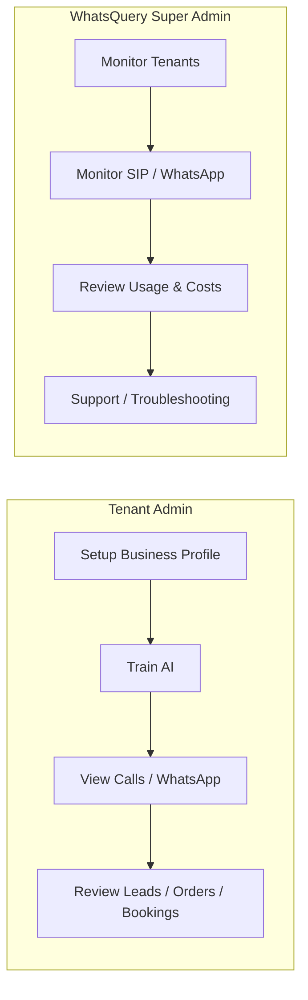

## 10. Security Model

Security controls include:

- Authentication for dashboard users
- Role-based access control
- Tenant-scoped database queries
- Platform-admin-only system views
- Tenant-only dashboard data
- Encrypted integration tokens
- Hashed webhook verification tokens where applicable
- Audit logs for sensitive actions
- Firewall restrictions
- SSL/TLS for web access
- SIP IP whitelisting where supported
- PostgreSQL not exposed publicly
- Backup monitoring

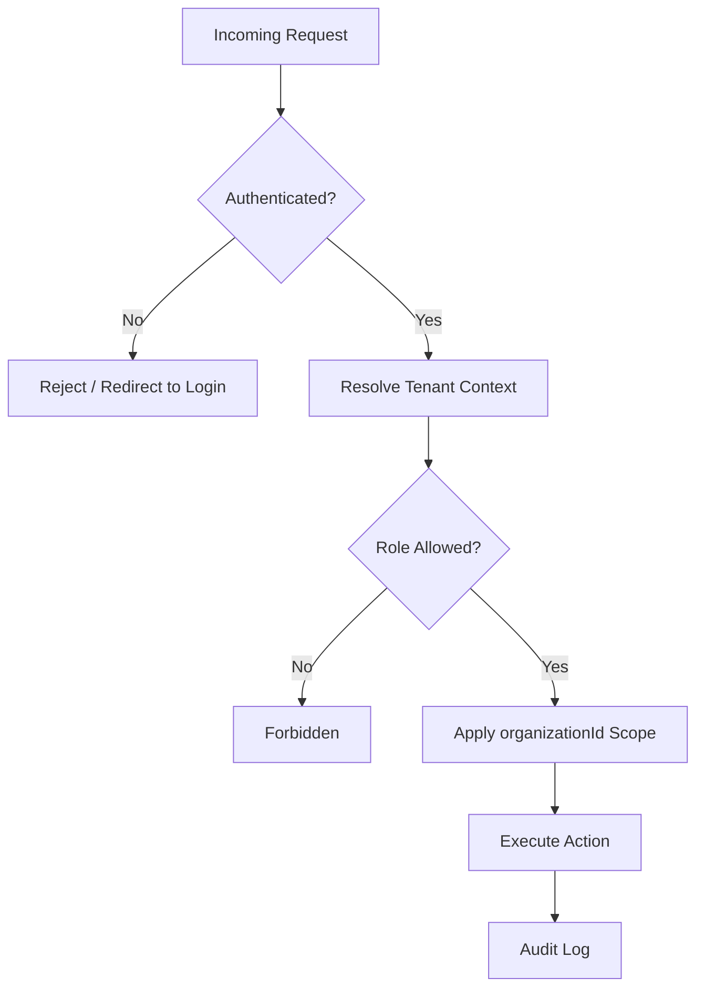

## 11. Pakistan-Hosted Deployment Model

For telco production, WhatsQuery can be hosted inside Pakistan using:

- Telco-approved cloud/data center
- Pakistan-based local cloud/VPS provider
- Colocated WhatsQuery-owned server infrastructure

Recommended production model separates critical layers:

- Load balancer / Nginx
- App/API server
- PostgreSQL database server
- SIP/Asterisk or SBC server
- Backup storage
- Monitoring/logging server or service

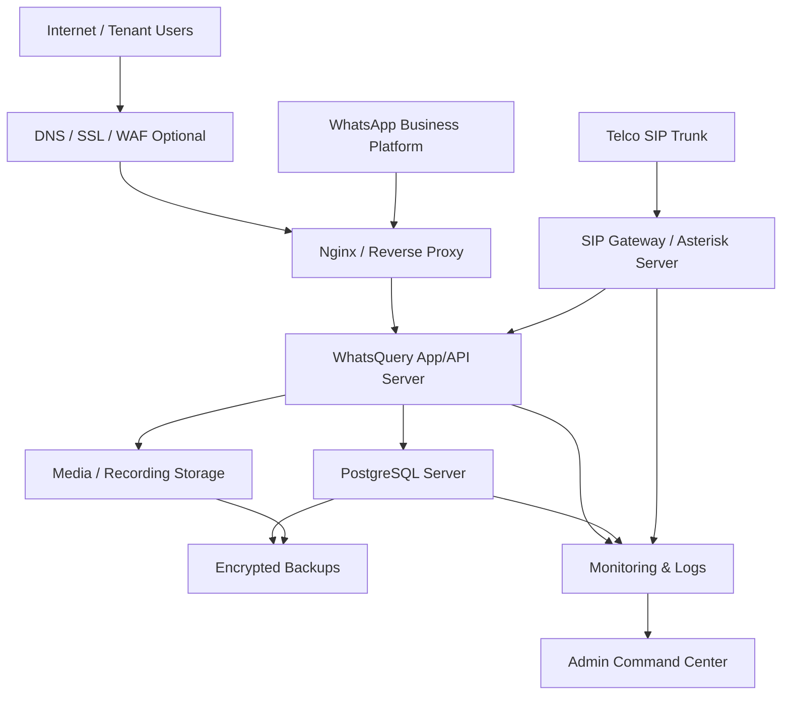

## 12. Pilot Deployment Model

For 5 to 10 early clients, a cost-effective pilot can run on Pakistan-hosted VPS/cloud.

Minimum pilot:

- 1 server
- 4 vCPU
- 8 GB RAM
- 100 GB SSD
- Static IP
- Docker Compose
- App/API, PostgreSQL, and Asterisk on one server
- Daily backups

Preferred pilot:

- App/API + database server
- Separate SIP/Asterisk server
- Static IP for SIP
- Daily off-server backups
- Basic monitoring

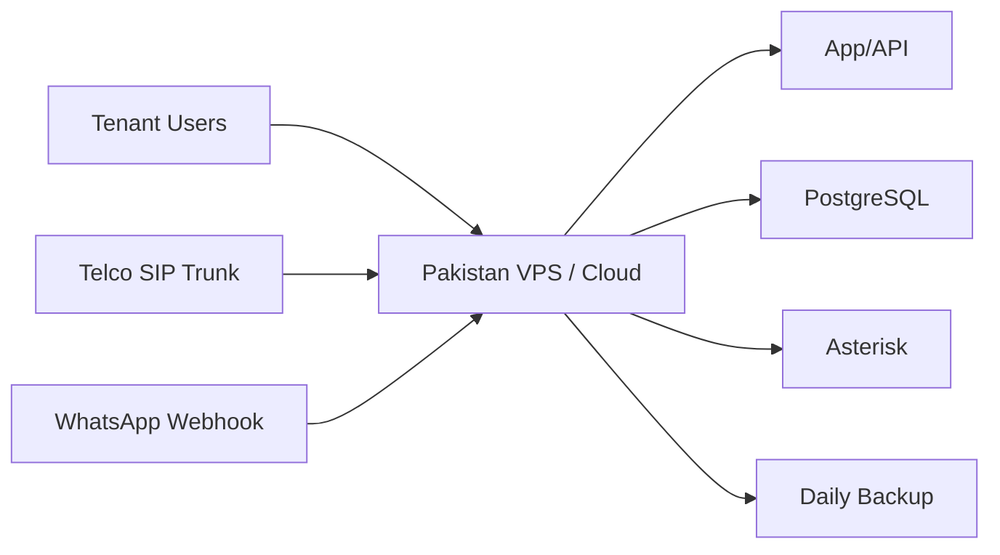

## 13. SIP Trunking Requirements

WhatsQuery requires the following SIP information from the telecom operator:

- SIP trunk type
- Static public IP requirements
- IP whitelisting process
- SIP authentication method
- DID/local number allocation
- Concurrent channel limit
- Codec support
- RTP port range
- Inbound routing rules
- Outbound routing rules
- Caller ID rules
- CDR access
- SLA and escalation contacts
- Test trunk credentials
- Firewall/NAT requirements
- Any local data residency requirements for CDRs and recordings

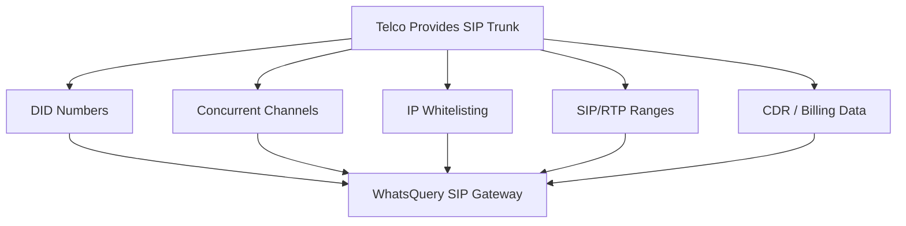

## 14. Monitoring and Capacity Planning

WhatsQuery monitors both infrastructure and product usage.

Infrastructure metrics:

- CPU
- RAM
- disk
- network
- app response time
- Nginx 4xx/5xx
- database connections
- slow queries
- backup status
- SIP service status

Tenant/product metrics:

- Calls
- Call minutes
- Missed calls
- WhatsApp conversations
- Leads
- Orders
- Bookings
- Assistant actions
- Storage usage
- Estimated cost where enabled

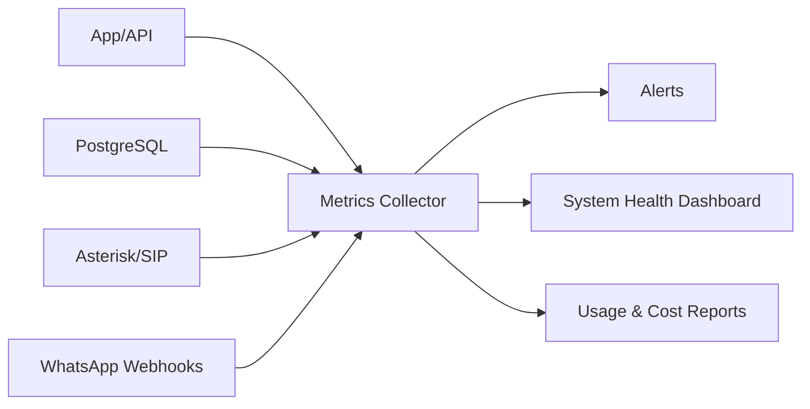

## 15. Backup and Disaster Recovery

Recommended backup model:

- Daily PostgreSQL backup
- Daily application file backup
- Daily SIP/Asterisk configuration backup
- Optional call recording backup
- Off-server backup storage
- Restore test schedule
- Rollback plan for deployments

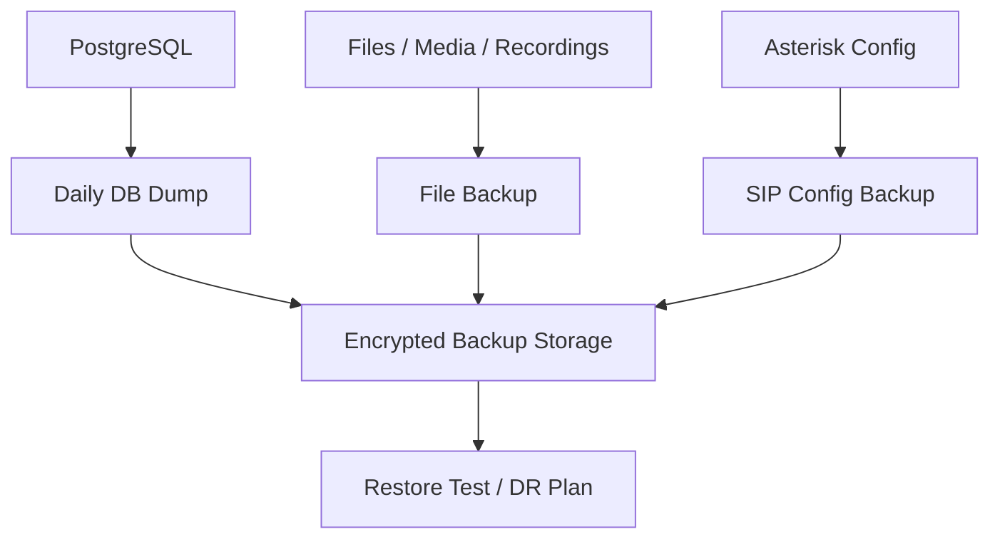

## 16. Deployment and Migration Flow

Migration from current early-stage VPS to Pakistan-hosted environment:

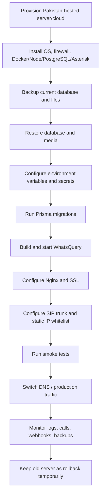

## 17. Compliance-Friendly Data Residency Approach

WhatsQuery can separate public and production workloads.

Recommended model:

- Public website and marketing assets can remain outside Pakistan if acceptable.
- Telecom production workloads should run inside Pakistan.
- Customer operational data should remain inside Pakistan.
- SIP traffic, CDRs, call logs, and recordings should remain inside Pakistan where required.
- Backups should be stored inside Pakistan if required by telco/data residency expectations.

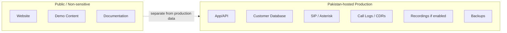

## 18. Telco Integration Responsibilities

WhatsQuery responsibilities:

- Application deployment
- Tenant isolation
- AI receptionist workflows
- Dashboard and admin controls
- SIP gateway configuration on WhatsQuery side
- Data storage and backups
- Monitoring and logs
- Security controls

Telco responsibilities:

- SIP trunk provisioning
- DID/local number allocation
- IP whitelisting
- SIP/RTP technical details
- CDR/billing reconciliation
- SLA and escalation support
- Data center/cloud hosting option if applicable

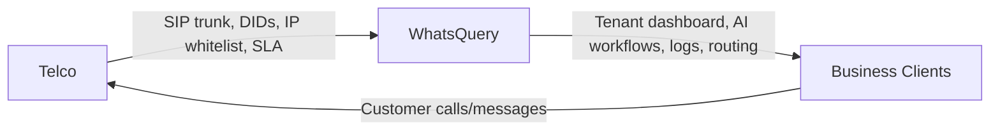

## 19. Suggested Pilot Scope

Initial pilot businesses:

- Cafe with 2 branches
- Restaurant with 4 branches

Pilot goals:

- Validate inbound SIP call routing
- Validate tenant-to-number mapping
- Validate AI receptionist greeting and business context
- Validate lead capture
- Validate order/table request capture
- Validate call logs and usage tracking
- Validate WhatsApp message flow
- Validate admin monitoring
- Validate backup and restore process

Pilot success criteria:

- Calls route to correct tenant
- WhatsApp messages route to correct tenant
- No cross-tenant data leakage
- Call logs and message logs are accurate
- Admin can monitor failed events
- Tenant can view only their own activity
- Backups complete successfully
- System remains stable under expected early traffic

## 20. Final Summary

WhatsQuery is designed to connect telecom communication channels with business databases and AI workflows. The platform can operate as a multi-tenant SaaS system while keeping telecom production data inside Pakistan when required.

For telco partnership, WhatsQuery is prepared to deploy production workloads through:

- Telco-approved cloud/data center
- Pakistan-based VPS/cloud provider
- WhatsQuery-owned colocated infrastructure

The recommended approach is to start with a Pakistan-hosted pilot, validate SIP and WhatsApp flows with real businesses, then scale into a separated production architecture with dedicated SIP, application, database, backup, and monitoring layers.

This keeps the deployment cost-effective at the beginning while remaining credible, secure, and scalable for telecom-grade production.
