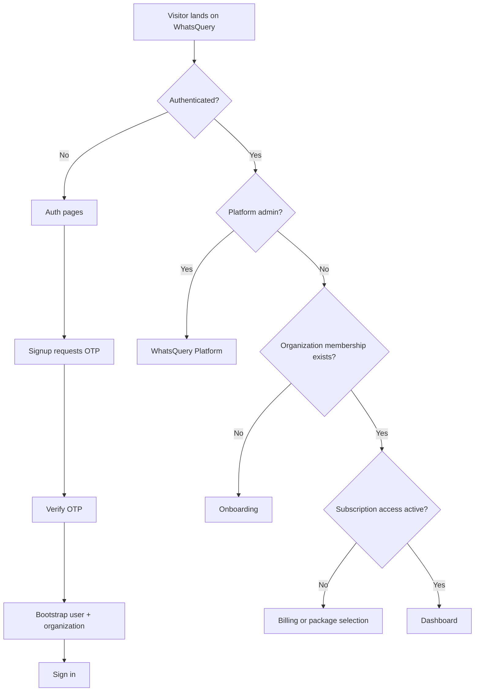
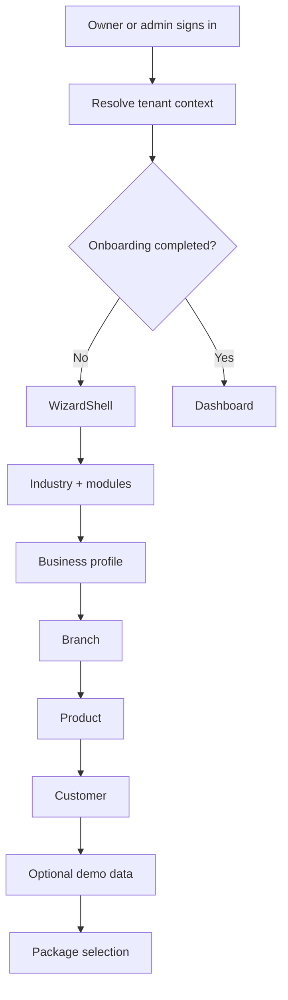
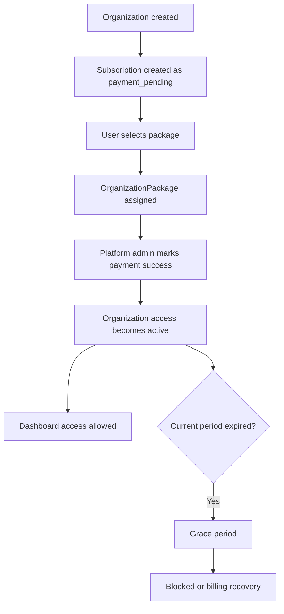
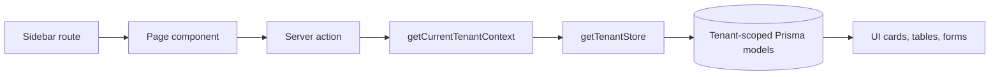
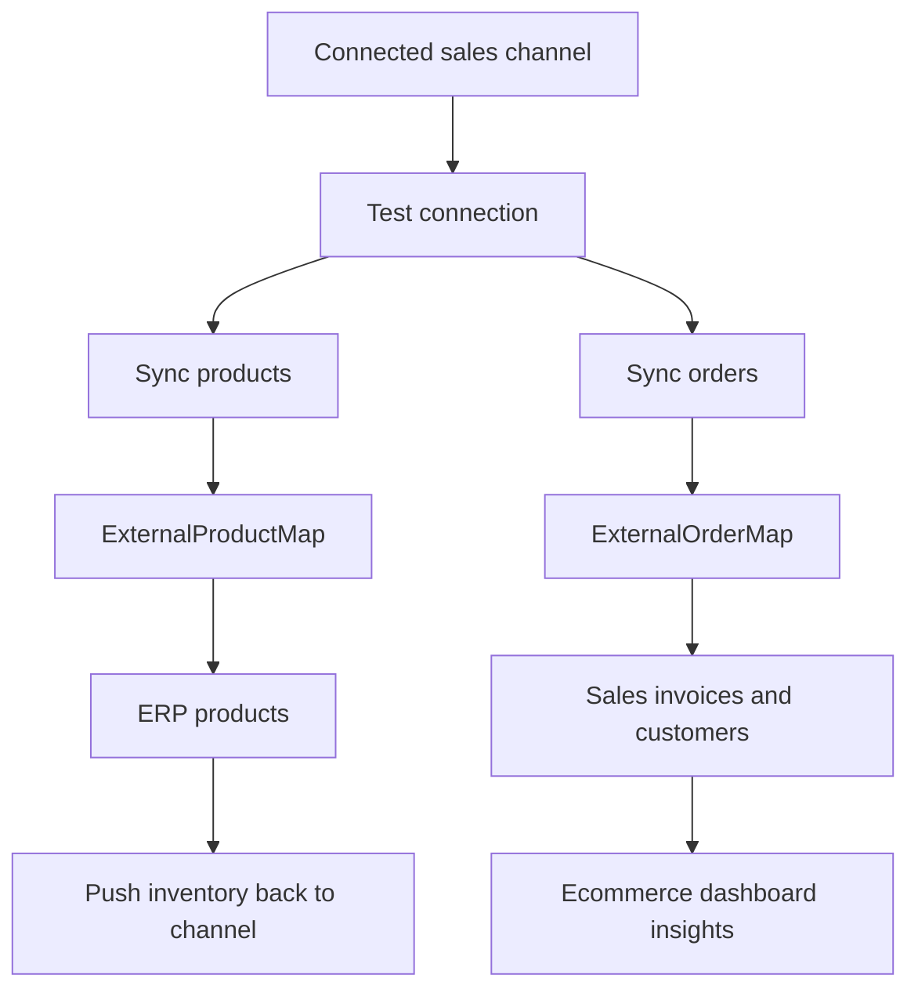

# WhatsQuery Flow Audit

## Audit Summary

### Root Causes

| Risk | Root cause | Affected areas |
| --- | --- | --- |
| Critical | Brand fragmentation across layouts, metadata, emails, onboarding, exports, and demo tooling made the product appear inconsistent and untrustworthy. | Marketing, auth, onboarding, exports, docs, emails |
| High | Mixed route topology between `app/(dashboard)/dashboard/*` and `app/(dashboard)/*` increases redirect complexity and makes layout exceptions harder to reason about. | Dashboard, demo script, route guards |
| High | Internal demo access relied on hardcoded email suffix checks and a wrong pathname match for `/dashboard/demo-script`. | Demo page, dashboard layout |
| High | Platform operators previously landed on a visible `/platform` entry instead of a hidden admin route, which weakened the “no public admin surface” story. | Admin access, login redirect, platform routes |
| High | Legacy `/signup` and `/integrations` links created broken or misleading navigation paths. | Marketing, dashboard sidebar, demo banners |
| Medium | `.env.example` did not match the actual SQLite datasource and was missing several required auth, integration, and demo variables. | Local setup, launch readiness |
| Medium | Signup country selection did not reliably default business currency, leaving PKR/GBP/AED/USD/SAR flows inconsistent for new tenants. | Signup, onboarding, pricing context |
| Medium | Several helpers still use raw Prisma and broad `@ts-nocheck` escape hatches, which makes future auditing harder. | Auth service, platform/service utilities |
| Medium | Tenant scoping is centralized in server helpers, but the Prisma extension strategy still depends on developers using the scoped store correctly. | All tenant modules |
| Low | There is no root middleware, so route access is enforced in layouts and server actions instead of at the edge. | Auth redirect UX, route protection |

### Files Changed In This Pass

- [app/layout.tsx](/C:/Users/WLD10/.gemini/antigravity/scratch/ddt-erp/app/layout.tsx)
- [app/(marketing)/layout.tsx](/C:/Users/WLD10/.gemini/antigravity/scratch/ddt-erp/app/(marketing)/layout.tsx)
- [app/(dashboard)/dashboard/layout.tsx](/C:/Users/WLD10/.gemini/antigravity/scratch/ddt-erp/app/(dashboard)/dashboard/layout.tsx)
- [app/(dashboard)/dashboard/demo-script/page.tsx](/C:/Users/WLD10/.gemini/antigravity/scratch/ddt-erp/app/(dashboard)/dashboard/demo-script/page.tsx)
- [app/auth/signin/page.tsx](/C:/Users/WLD10/.gemini/antigravity/scratch/ddt-erp/app/auth/signin/page.tsx)
- [app/auth/signup/page.tsx](/C:/Users/WLD10/.gemini/antigravity/scratch/ddt-erp/app/auth/signup/page.tsx)
- [app/onboarding/layout.tsx](/C:/Users/WLD10/.gemini/antigravity/scratch/ddt-erp/app/onboarding/layout.tsx)
- [components/sidebar.tsx](/C:/Users/WLD10/.gemini/antigravity/scratch/ddt-erp/components/sidebar.tsx)
- [components/dashboard/whats-new-panel.tsx](/C:/Users/WLD10/.gemini/antigravity/scratch/ddt-erp/components/dashboard/whats-new-panel.tsx)
- [components/marketing/referral-tracker.tsx](/C:/Users/WLD10/.gemini/antigravity/scratch/ddt-erp/components/marketing/referral-tracker.tsx)
- [components/marketing/seo/SeoHero.tsx](/C:/Users/WLD10/.gemini/antigravity/scratch/ddt-erp/components/marketing/seo/SeoHero.tsx)
- [modules/emails/templates.tsx](/C:/Users/WLD10/.gemini/antigravity/scratch/ddt-erp/modules/emails/templates.tsx)
- [modules/otp/service.ts](/C:/Users/WLD10/.gemini/antigravity/scratch/ddt-erp/modules/otp/service.ts)
- [.env.example](/C:/Users/WLD10/.gemini/antigravity/scratch/ddt-erp/.env.example)
- [package.json](/C:/Users/WLD10/.gemini/antigravity/scratch/ddt-erp/package.json)
- [lib/country-currency.ts](/C:/Users/WLD10/.gemini/antigravity/scratch/ddt-erp/lib/country-currency.ts)
- [lib/security/access.ts](/C:/Users/WLD10/.gemini/antigravity/scratch/ddt-erp/lib/security/access.ts)
- [lib/security/guards.ts](/C:/Users/WLD10/.gemini/antigravity/scratch/ddt-erp/lib/security/guards.ts)
- [lib/server-access.ts](/C:/Users/WLD10/.gemini/antigravity/scratch/ddt-erp/lib/server-access.ts)
- [modules/auth/actions.ts](/C:/Users/WLD10/.gemini/antigravity/scratch/ddt-erp/modules/auth/actions.ts)
- [modules/auth/service.ts](/C:/Users/WLD10/.gemini/antigravity/scratch/ddt-erp/modules/auth/service.ts)
- [modules/command-center/actions.ts](/C:/Users/WLD10/.gemini/antigravity/scratch/ddt-erp/modules/command-center/actions.ts)
- [app/wq-command-center/page.tsx](/C:/Users/WLD10/.gemini/antigravity/scratch/ddt-erp/app/wq-command-center/page.tsx)
- [scripts/final-seed.ts](/C:/Users/WLD10/.gemini/antigravity/scratch/ddt-erp/scripts/final-seed.ts)
- [next.config.ts](/C:/Users/WLD10/.gemini/antigravity/scratch/ddt-erp/next.config.ts)

## Flow Diagrams

### 1. Auth Flow



### 2. Onboarding Flow



### 3. Subscription / Package Flow



### 4. Tenant Access Flow

```mermaid
flowchart TD
  A[Request hits server component or action] --> B[auth()]
  B --> C{Platform admin?}
  C -->|Yes| D[Platform routes only]
  C -->|No| E[getCurrentTenantContext()]
  E --> F[Resolve organization membership]
  F --> G[Resolve branch from cookie or assignment]
  G --> H[Permission or role checks]
  H --> I[getTenantStore scoped by organizationId]
  I --> J[Module data access]
```

### 5. ERP Module Data Flow



### 6. Admin / Platform Flow

```mermaid
flowchart TD
  A[Platform user signs in] --> B{isPlatformAdminEmail?}
  B -->|No| C[Redirect to tenant app]
  B -->|Yes| D[/wq-command-center]
  D --> E[Organization controls]
  D --> F[Package assignment]
  D --> G[Manual payment approval]
  D --> H[Hidden /platform tools]
  H --> I[Packages]
  H --> J[Exports]
  H --> K[Leads]
```

### 7. Ecommerce Sync Flow



### 8. Error Map

```mermaid
flowchart TD
  A[Broken signup or CTA links] --> B[Legacy /signup hrefs]
  B --> C[404 or wrong redirect]
  C --> D[Fixed to /auth/signup]

  E[Platform admin blocked from demo page] --> F[Wrong pathname check in dashboard layout]
  F --> G[/dashboard/demo-script redirected away]
  G --> H[Fixed pathname handling]

  I[Internal demo page exposed too broadly] --> J[Email suffix based access]
  J --> K[Weak internal-only gate]
  K --> L[Fixed with platform-admin or demo-tenant owner/admin rule]

  Q[Admin route too visible] --> R[Operators redirected to /platform]
  R --> S[Publicly guessable admin surface]
  S --> T[Fixed with /wq-command-center as the primary operator route]

  M[Brand inconsistency] --> N[Old product names in metadata, emails, and UI]
  N --> O[Reduced trust in demos]
  O --> P[Replaced with WhatsQuery]
```

## Module / Node Audit Notes

| Module | Current state | Notes |
| --- | --- | --- |
| Dashboard | Working, tenant-scoped | Main risk is mixed route grouping and some themed copy still needing cleanup. |
| Customers | Working | Uses tenant-scoped server actions. |
| Suppliers | Working | Uses tenant-scoped server actions. |
| Products | Working | Tenant-scoped; inventory linkage depends on scoped writes. |
| Inventory | Working | Stock alerts and dashboard widgets are active. |
| Sales invoices | Working | Demo-safe for seeded tenant. |
| Purchase invoices | Working | Demo-safe for seeded tenant. |
| Quotations | Present | Needs a deeper UX review before sales-heavy demos. |
| Returns | Present | Functional surface exists, but lower demo priority. |
| Payments / Expenses | Present | Should be tested with seeded data before finance-focused demos. |
| Ledger / Accounts | Present | Demoable, but accounting language still needs brand polish. |
| Reports | Working | Advanced-report gating still depends on plan feature flags. |
| Notifications | Working | Demo data seeded. |
| Audit logs | Present | Access is gated by plan and role; okay for internal/admin demos. |
| Branches / Roles / Users | Present | Tenant-scoped, but role/permission UX still deserves follow-up review. |
| Integrations | Working | Shared hub is good; settings pages are demo-ready. |
| Platform admin | Working | Stronger than demo-script security, but branding still needs broader cleanup outside this pass. |

## Remaining Risks

- The app still contains mixed route patterns that should be normalized over time.
- Some modules still use `@ts-nocheck`, which hides correctness issues from TypeScript.
- Several marketing/industry pages still need a full content polish pass beyond the core branding cleanup completed here.
- Tenant safety relies heavily on disciplined use of `getTenantStore`; a future refactor should add stronger guardrails or repository-level patterns.
