# WhatsQuery Integration Foundation

Date: July 22, 2026

## Purpose

This foundation adds the shared, tenant-aware architecture for future integrations without falsely claiming that Google, Microsoft, HubSpot, WhatsApp Business, Stripe, Twilio, Zapier, or Universal REST are complete.

Today, only the `internal_test` provider is connectable.

## Implemented layers

- Provider registry
- Provider adapter contract
- Tenant integration model
- Encrypted credential vault
- OAuth state foundation
- Permission engine
- Approval request model
- Action executor
- Health evaluation
- Usage tracking
- Voice-tool exposure filter
- Integration marketplace foundation UI

## High-level flow

```mermaid
flowchart LR
  A["Verified industry profile"] --> B["Provider recommendations"]
  B --> C["Tenant connection"]
  C --> D["Encrypted credentials"]
  D --> E["Permission evaluation"]
  E --> F["Approval or direct execution"]
  F --> G["Provider adapter"]
  G --> H["Redacted result"]
  H --> I["Audit log + usage + health"]
```

## Main code locations

- `modules/integrations/core/types.ts`
- `modules/integrations/core/registry.ts`
- `modules/integrations/core/action-registry.ts`
- `modules/integrations/core/vault.ts`
- `modules/integrations/core/oauth.ts`
- `modules/integrations/core/permissions.ts`
- `modules/integrations/core/voice-tools.ts`
- `modules/integrations/providers/internal-test/adapter.ts`
- `modules/integrations/foundation-service.ts`
- `app/api/integrations/*`

## Database layer

New models were added for:

- `IntegrationProvider`
- `TenantIntegration`
- `IntegrationResource`
- `IntegrationPermission`
- `IntegrationSyncJob`
- `IntegrationEvent`
- `IntegrationActionLog`
- `IntegrationApprovalRequest`
- `IntegrationHealthCheck`
- `IntegrationFieldMapping`
- `IntegrationUsageRecord`
- `IntegrationOAuthState`
- `IntegrationWebhookEndpoint`
- `IntegrationWebhookDelivery`

## Current limitations

- The prior onboarding migration is still not applied to the active Supabase development database because `prisma migrate dev` failed on July 22, 2026 with a schema-engine error before apply.
- The sync engine is schema-backed but not yet wired to a production worker loop.
- External providers remain intentionally incomplete.
